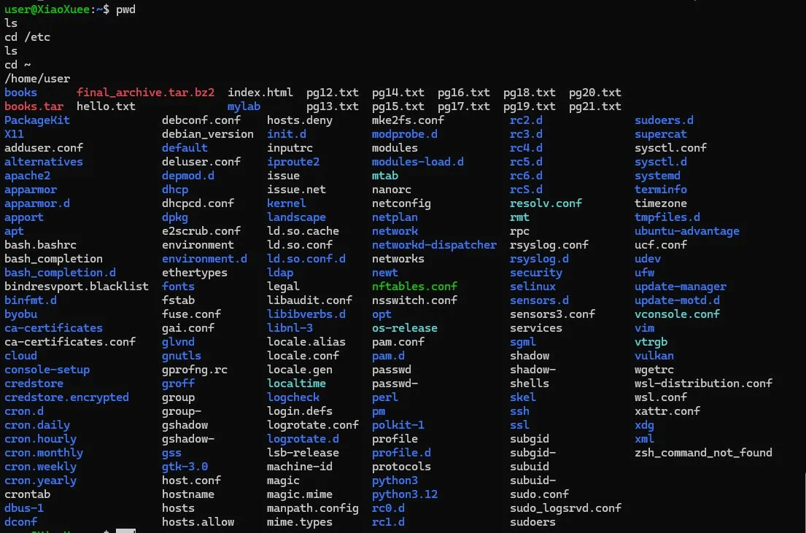
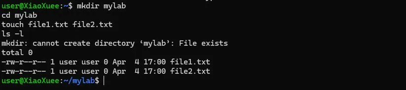
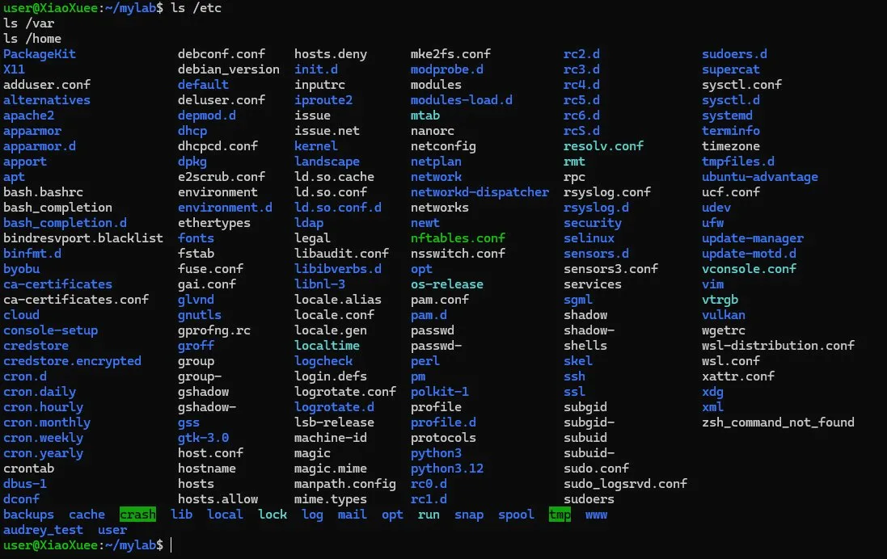
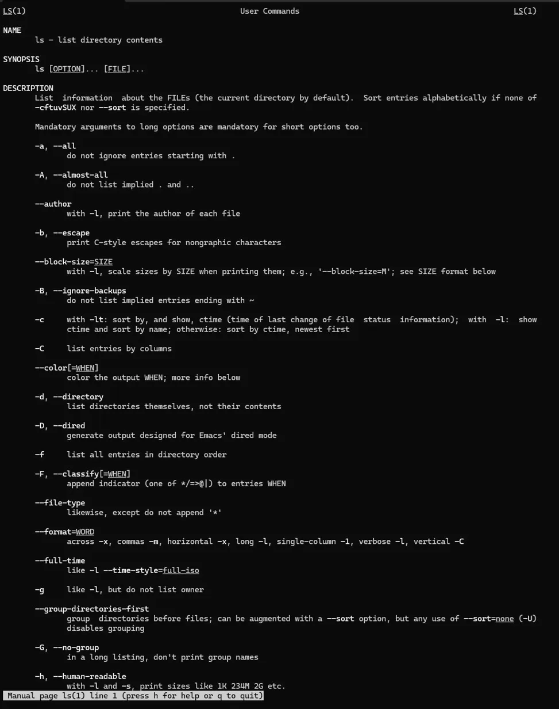
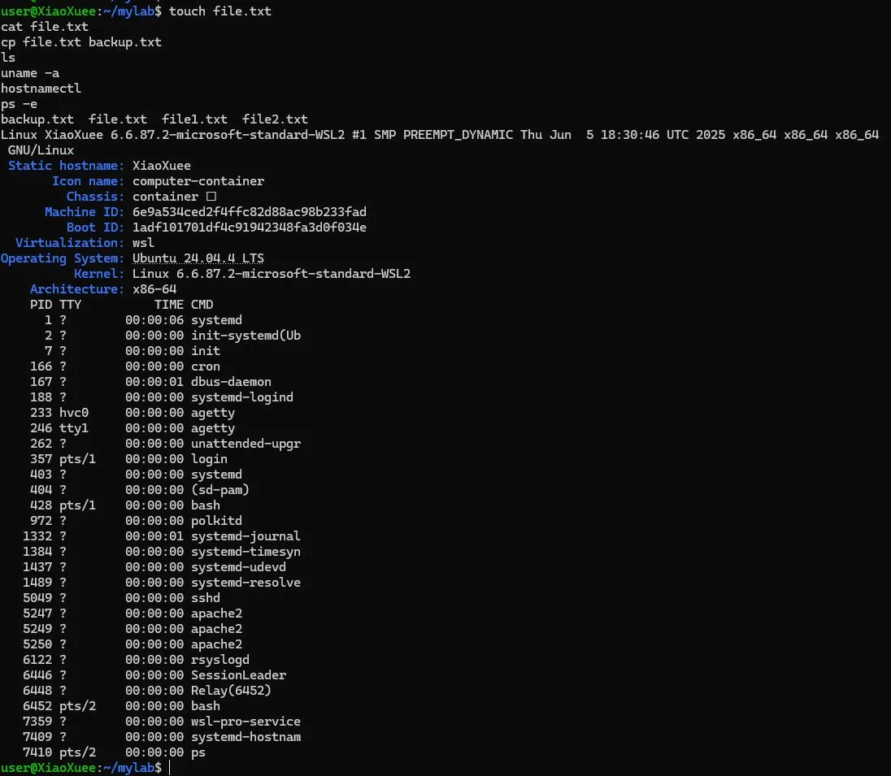
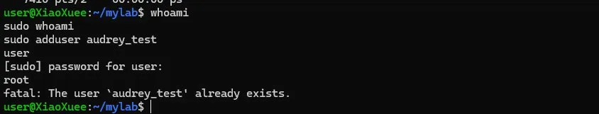
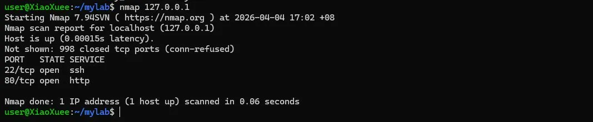
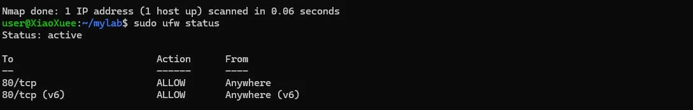
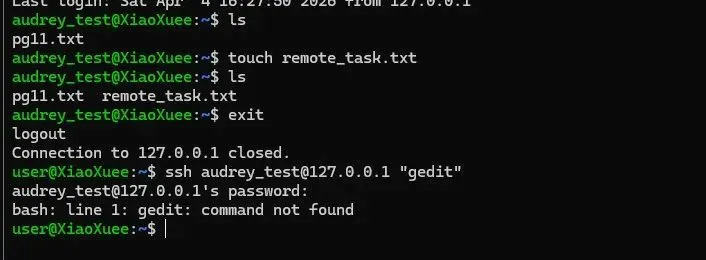

# BRG-27 — Infrastructure Systems Engineering Activity (ISEA)

**Student:** Teo Qing Ya Audrey  
**Kaplan ID:** CT0384570  
**Murdoch ID:** 36060198  
**Module:** BRG-27 Introduction to Server Environments and Architectures  
**Host OS:** Windows 11 Pro  
**Linux Environment:** Ubuntu 24.04.4 LTS via WSL 2

---

## About This Repository

This repository documents my hands-on lab work for the BRG-27 Infrastructure Systems Engineering Activity module at Murdoch University. Each folder corresponds to a lab session covering a core area of Linux administration, cloud infrastructure, and server management.

The labs progress from foundational Linux skills — setting up the environment, navigating the file system, managing services and permissions — through to real-world infrastructure topics such as cloud provisioning on AWS, DNS configuration, SSL certificates, and shell scripting automation.

All Linux lab work was performed on Ubuntu 24.04.4 LTS running natively on Windows 11 via WSL 2. Cloud labs were performed on Amazon Web Services (AWS) using the free tier. Each lab folder contains a written walkthrough of the steps taken, commands used, observations made, and reflections on what was learned. Screenshots are included as evidence of hands-on completion.

This repository also serves as preparation for the final video demonstration, where all lab work and key technical concepts will be presented and explained.

---

## Environment

| Component | Details |
|-----------|---------|
| Host OS | Windows 11 Pro |
| Linux Method | Windows Subsystem for Linux (WSL 2) |
| Distribution | Ubuntu 24.04.4 LTS (Noble Numbat) |
| Kernel | 6.6.87.2-microsoft-standard-WSL2 |
| Architecture | x86_64 |

---

# Lab 1b — Familiarity with Ubuntu Linux

**Module:** BRG-27 ISEA  
**Day:** 1b  
**Status:** Completed

---

## Objective

Get hands-on with core Linux administration — from basic command line navigation through to managing services, users, firewalls, SSH, and file compression. The loopback address `127.0.0.1` was used to simulate a partner machine, which is common industry practice for testing network configurations locally before going live.

---

## Environment

| Component | Details |
|-----------|---------|
| OS | Ubuntu 24.04.4 LTS via WSL 2 |
| Shell | bash |
| Primary User | XiaoXuee |
| Simulated Partner | audrey_test (via 127.0.0.1) |

---

## Learning Objectives

- Navigate the Linux file system using basic CLI commands
- Install and configure Apache, SSH server, and firewall (UFW)
- Test web service accessibility over LAN
- Use nmap to detect open services and ports
- Use SSH and SCP for remote access and file transfer
- Create and manage users and understand privilege separation
- Compress and decompress files using tar and bzip2

---

## Part 1 — Basic Command Line Navigation

Practised moving around the Linux file system using `pwd`, `ls`, and `cd`. `pwd` confirmed the home directory at `/home/user`. `ls /etc` revealed the full collection of system configuration files. `cd ~` returned to home from any location.

---

## Part 2 — Creating Files and Directories

Used `mkdir` and `touch` to create a working directory and files inside it. `ls -l` confirmed both files were created with `-rw-r--r--` permissions.

---

## Part 3 — Linux Directory Structure

Explored the three key system directories:

| Directory | Purpose |
|-----------|---------|
| `/etc` | System-wide configuration files — network, accounts, service configs |
| `/var` | Variable runtime data — logs, mail, spool, crash reports |
| `/home` | User home directories — personal files and settings per user |

---

## Part 4 — Manual Pages

Used `man ls` to explore the built-in documentation for the `ls` command. The man page shows every available flag and option without needing internet access.

---

## Part 5 — CLI File Operations & System Info

Practised creating, copying, and viewing files. Checked system information using `uname -a`, `hostnamectl`, and `ps -e`. The process list confirmed services like `sshd`, `apache2`, and `systemd` were running.

---

## Part 6 — Super User & Permissions

Demonstrated privilege escalation with `whoami` and `sudo whoami`. Attempted `adduser` without sudo — it failed. With sudo it succeeded.

---

## Part 7 — SSH & User Management

Installed OpenSSH server and created user `audrey_test` to simulate a partner. SSH'd into the local machine via the loopback address.

---

## Part 8 — Apache Web Server, index.html & Nmap

**Step 1 — Install Apache and test web access**

Installed Apache using `sudo apt install apache2` and visited `http://127.0.0.1` in the browser to confirm the default page was live. Used `ip a` to determine the machine's IP address.

**Step 2 — Edit index.html and share with partner**

Edited `/var/www/html/index.html` using nano to replace the default Apache page with a custom page — "Peer Page, Modified by Audrey Teo". Verified the content with `cat` then visited `http://127.0.0.1` in the browser to confirm the change was live.

**Step 3 — Scan ports with Nmap and observe open services**

Ran `nmap 127.0.0.1` to scan the machine. Both port 22 (SSH) and port 80 (HTTP) showed as open, confirming Apache and SSH were running and accessible.

**Step 4 — Remove Apache and rerun Nmap to observe differences**

Stopped and removed Apache using `sudo apt remove apache2 -y`, then reran Nmap. Port 80 disappeared from the results — only port 22 remained. This confirms that removing a service directly closes its port and removes it from the network surface.

---

## Part 9 — UFW Firewall

Enabled UFW and allowed port 80. Status confirmed the rule was active for both IPv4 and IPv6. Blocking port 80 via UFW prevented web access even with Apache running — showing the firewall and the service are independent security layers.

---

## Part 10 — File Compression with tar & bzip2

Downloaded books from Project Gutenberg using `wget`, organised them, and compressed using `tar` and `bzip2`. `bzip2` was not installed by default and was installed via `apt`.

---

## Challenge Activities

### Challenge 1 — Remote File Creation via SSH

SSH'd into `audrey_test` and created `remote_task.txt` remotely, confirming SSH gives full shell access.

### Challenge 2 — Remote GUI Apps via SSH

Attempted to launch `gedit` over SSH — it failed because `gedit` requires a display server. SSH provides terminal access only.

### Challenge 3 & 4 — SCP File Transfer

Used SCP to transfer a file and recursively copy the entire `books/` directory to the partner machine. Transfer completed successfully.

---

## Issues Encountered

| Issue | Resolution |
|-------|------------|
| `bzip2` not installed | Ran `sudo apt install bzip2 -y` |
| `gedit` failed over SSH | Expected — GUI apps require `ssh -X` for display forwarding |

---

## Outcome

- Navigated the Linux file system using `pwd`, `ls`, `cd`, `mkdir`, and `touch`
- Explored `/etc`, `/var`, and `/home` and understood what each directory is used for
- Used `man` pages as a built-in reference for command documentation
- Installed and configured Apache, SSH server, and UFW firewall
- Edited `index.html` using nano and verified changes with `cat`
- Created a new user and SSH'd between accounts using the loopback address
- Scanned ports with Nmap before and after removing Apache — confirmed port 80 disappeared
- Downloaded files with `wget`, compressed with `tar` and `bzip2`, transferred with `scp`
- Demonstrated privilege escalation with `sudo` and discussed the principle of least privilege

---

## Reflection

Using `127.0.0.1` as a loopback to simulate a partner was a practical way to test SSH and SCP without needing a second machine. In real infrastructure the same commands apply — just replace the loopback with the actual server IP. The UFW exercise highlighted that a running service and a firewall rule are independent controls — a service can be live but completely unreachable if the firewall blocks its port. The gedit failure over SSH was a good reminder that servers are headless by default and everything must be managed through the terminal.

---

[Back to Main README](../README.md)
